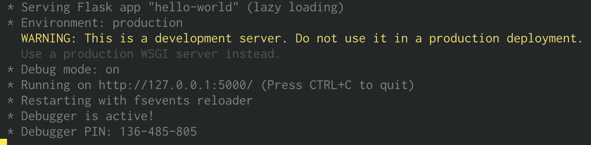
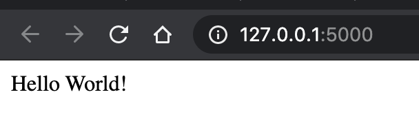
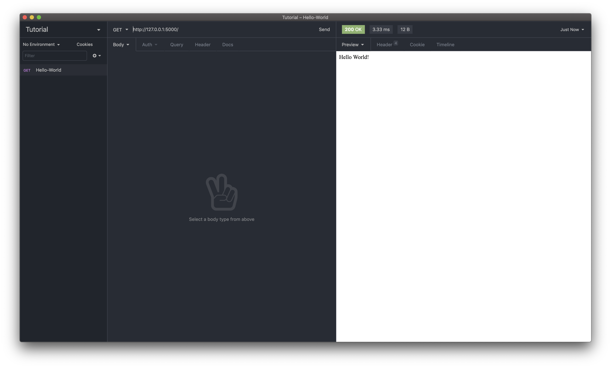
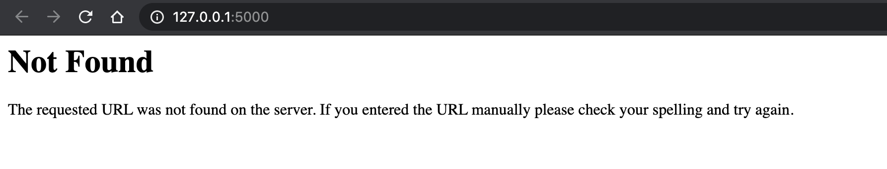
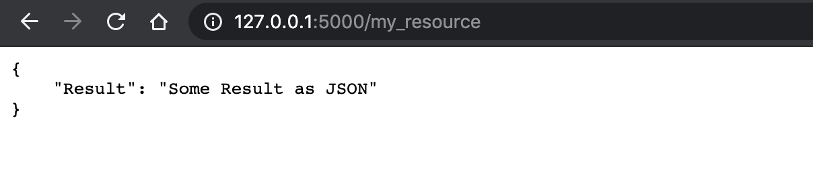
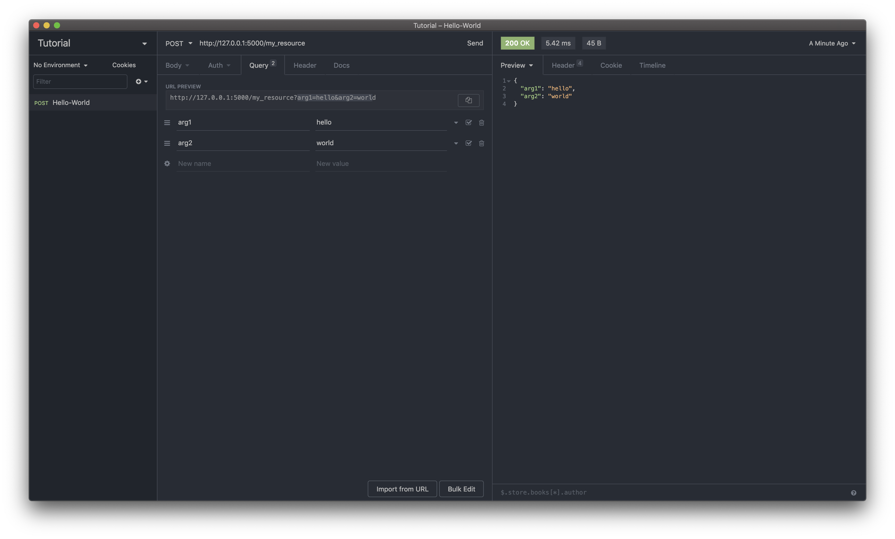

title: Creating a Web Application and REST API with MongoDB and Python

## Why Python?
When we talk about web programming, Python is not the first thing we think of. For designing our front-end, we think *Javascript*, *HTML*, and *CSS*. We think *Java*, *Go* or *NodeJS* for our backend. Python is often relegated to data sciences and machine learning, but this dynamically typed and interpreted language can serve many purposes with the right libraries/modules. Before we can jump in with Python, we must install and get it running! You can use the README from my [GitHub Repo](https://git.target.com/SaadAhmad/Mongo-Rest) to do this.

## Python and the Web
As I mentioned earlier, Python is a very versatile language. With the right libraries, we can serve a full stack web app and REST API. For this tutorial, we will be using **Flask, Flask-Restful, PyMongo, Flask-PyMongo, and WTForms**. For our front-end, we will be using *Jinja* as our templating engine and *Bootstrap* to make our web app dynamic. All of my code and these dependencies are available on the README from my [GitHub Repo](https://git.target.com/SaadAhmad/Mongo-Rest). Now, let's jump into the different libraries!

### Flask and Flask-Restful
To build web applications in Python, there are many frameworks we could use. For this tutorial we are going to focus on Flask. Flask is a micro web framework for Python. Flask's mission it to keep things simple and acessible to get applications up and running very quickly. Flask also does not make many decisions for you instead it supports different libraries to add functionality. If you are new to Flask or web development, this [documentation](https://flask.palletsprojects.com/en/1.1.x/) will help greatly.

Before we jump further into this tutorial, let's try out the hello world tutorial from the [Flask Quickstart Guide](https://flask.palletsprojects.com/en/1.1.x/quickstart/)

```python
# import flask to use it
from flask import Flask

# make the flask app
app = Flask(__name__)

# routing our first endpoint
@app.route('/')
def hello_world():
    return 'Hello World!'

# we run the app under this block to prevent it from running in other modules/files
if __name__ == '__main__':
    # setting debug to True allows the server to automatically reload
    app.run(debug=True)

```

To test this endpoint, we can use cURL or our favorite browser, but to save us time and simplifiy some complexity, we will use a REST client to test our methods. In this tutorial, I will use [Insomnia](https://insomnia.rest/) but [Postman](https://www.postman.com/) or your favorite REST client work the same.

To test our endpoint, we must run the script by typing in our terminal ```python3``` followed by the python file. In my case, I would type ```python3 hello-world.py```. This is what my terminal looks like:



When the server is running, you will get a local development IP (mine is http://127.0.0.1:5000/) that you can follow to the endpoint.

This is how the endpoint looks on my browser:



This is how it looks on Insomnia:



We can build onto this by importing more libraries and adding logic to our endpoints. Let's do that now! We are going import *Flask-Restful*, a lightweight extension to help us make our REST-API with ease while encouraging the best practices. You can always use vanilla Flask if you do not want to use *Flask-Restful*.

**Let's extend what we wrote earlier:**
```python
from flask import Flask
# import flask-restful to create our api
from flask_restful import Resource, Api, reqparse

app = Flask(__name__)

# create the api from the app
api = Api(app)
# add a string secret (can be anything)
app.secret_key = 'some secret key'

# define a class that extends the Resource class to overload HTTP Methods
class My_Resource(Resource):

    # overload the GET method and return a valid status code
    def get(self):
        status_code = 200
		return {'Result': 'Some Result as JSON'}, status_code

    # overload the Post method
	def post(self):
		# parse your query parameters
		parser = reqparse.RequestParser()
		parser.add_argument('arg1', required=True)
		parser.add_argument('arg2', required=True)
		args = parser.parse_args()
        status_code = 200
		return {'arg1' : args.arg1, 'arg2' : args.arg2}, status_code


# add the resource we created to an endpoint
api.add_resource(My_Resource, '/my_resource')

if __name__ == '__main__':
    app.run(debug=True)
```

Let's test it! Just like last time, run the script and load the IP!



What's this? It was not found because we did not route a resource to that function! Let's try again:



Let's try our POST method now with Insomnia, with the query parameters as ```arg1=hello``` and ```arg2=world```


